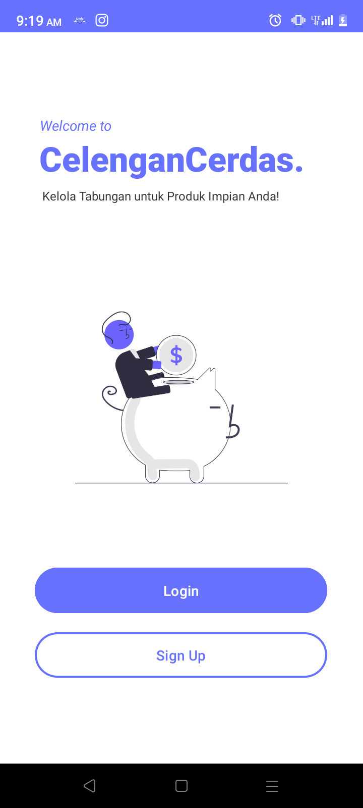
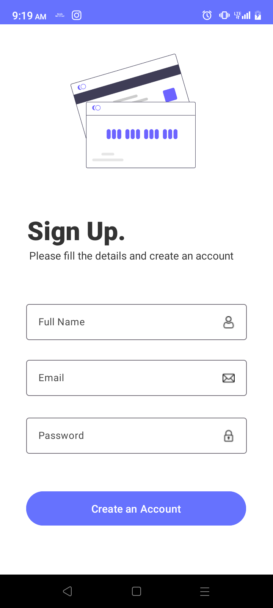
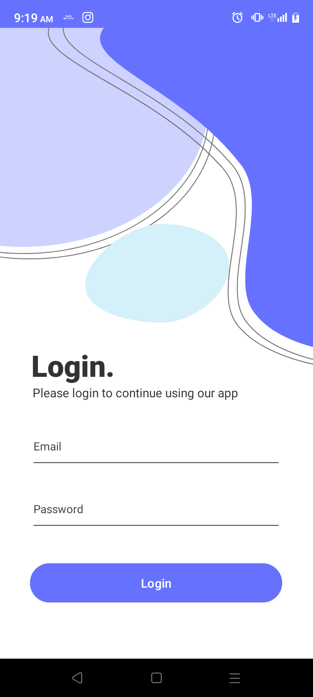
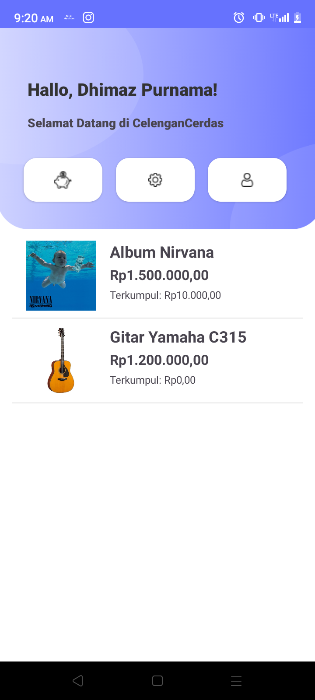
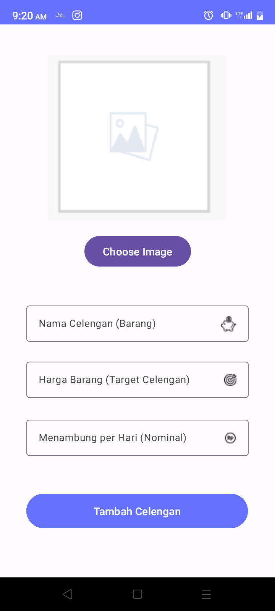
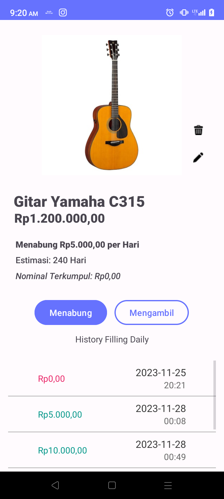
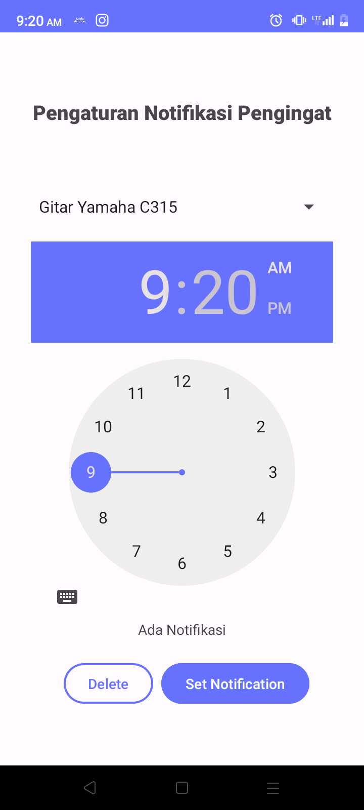
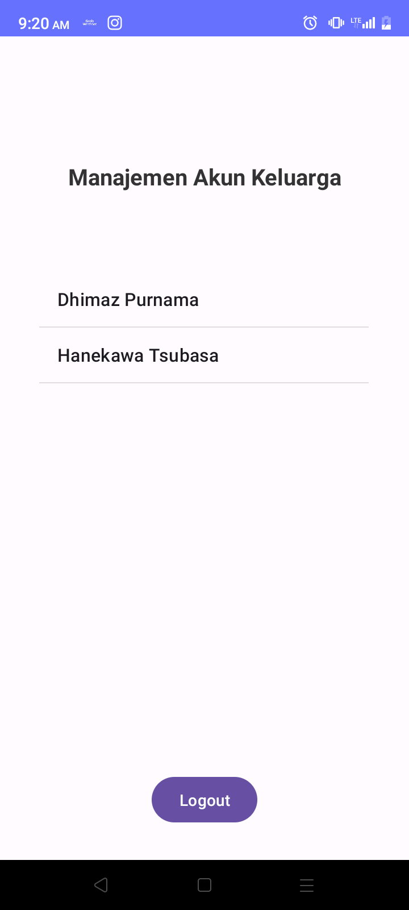
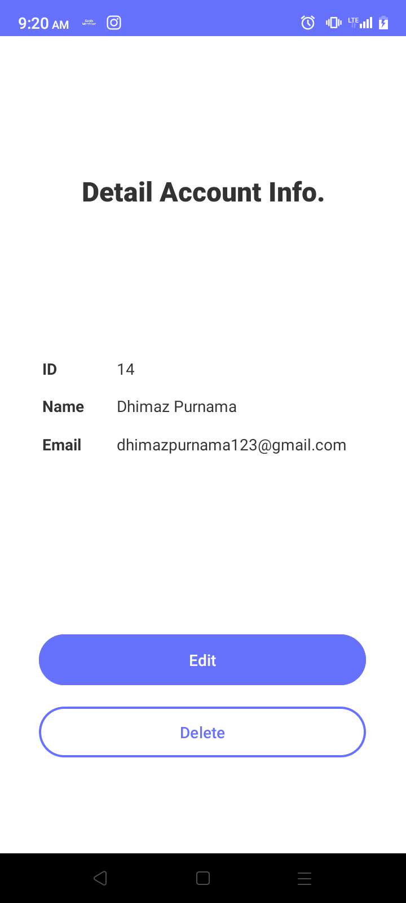

# USER MANUAL - CELENGAN CERDAS

## 1 GENERAL INFORMATION

Celengan Cerdas adalah aplikasi inovatif yang dirancang untuk memudahkan pengguna dalam mencapai tujuan menabung untuk membeli barang atau mencapai target tertentu. Aplikasi ini menyediakan fitur-fitur canggih untuk memfasilitasi proses menabung, termasuk:

- **Detail Target Barang**: Memungkinkan pengguna untuk menentukan target menabung berdasarkan nama, gambar, dan Harga.

- **Target Menabung Mingguan**: Fitur ini memungkinkan pengguna menetapkan jumlah uang yang ingin mereka tabung setiap minggu untuk mencapai tujuan mereka.

- **Notifikasi Alarm** : Aplikasi ini dilengkapi dengan fitur pengingat notifikasi alarm yang dapat diatur sesuai keinginan pengguna. Notifikasi ini membantu pengguna untuk tetap konsisten dalam menabung dan mencapai target mereka.

Celengan Cerdas memberikan pengalaman menabung yang intuitif dan menyenangkan, membantu pengguna mengelola keuangan mereka secara efisien untuk mencapai impian pembelian atau tujuan mereka.

## 2. GETTING STARTED

### 2.1 Installation and Logging In

Berikut adalah langkah-langkah umum untuk menginstal aplikasi Celengan Cerdas berbasis Android menggunakan file APK:

> **Catatan**: _Sebelum mengikuti langkah-langkah ini, pastikan bahwa Anda telah mengizinkan instalasi aplikasi dari sumber yang tidak dikenal di pengaturan perangkat Android Anda._

    *anda dapat mengaktifkan opsi ini di "Pengaturan" -> "Keamanan" -> "Sumber yang tidak dikenal".

1. Download File APK:

        Buka browser di perangkat Android Anda.

    Kunjungi situs web resmi Celengan Cerdas atau sumber tepercaya lainnya yang menyediakan file APK aplikasi.
    Unduh file APK Celengan Cerdas ke perangkat Android Anda.

2. Buka File Manager:

    Buka aplikasi File Manager di perangkat Android Anda. Jika tidak ada aplikasi File Manager, Anda dapat menggunakan aplikasi yang telah diinstal sebelumnya atau mengunduh satu dari Google Play Store.

3. Temukan File APK:

    Navigasi ke folder di mana Anda menyimpan file APK Celengan Cerdas setelah diunduh.

4. Izinkan Instalasi dari Sumber yang Tidak Dikenal:

        Jika belum diaktifkan, sistem akan meminta izin untuk menginstal aplikasi dari sumber yang tidak dikenal.

    Ketuk "Pengaturan" ketika muncul notifikasi.
    Aktifkan opsi "Sumber yang Tidak Dikenal" dan kembali ke proses instalasi.

5. Instal Aplikasi:

        Kembali ke File Manager dan ketuk file APK Celengan Cerdas.

    Ketuk opsi "Instal" saat diminta.
    Tunggu hingga proses instalasi selesai.

6. Buka Aplikasi:

    Setelah instalasi selesai, ketuk "Buka" atau temukan ikon Celengan Cerdas di layar utama perangkat Anda.

Sekarang, Anda seharusnya dapat menggunakan Celengan Cerdas di perangkat Android Anda. Pastikan untuk mengikuti petunjuk selanjutnya yang mungkin muncul di aplikasi untuk mengonfigurasi preferensi dan mulai menetapkan target menabung Anda.

### 2.2 Application Menu

1. Onboard

    

2. Signup

    

3. Login

    

4. Home
   

5. Tambah Celengan

    

6. Detail Celengan

    

7. Set Notifikasi

   

8. Manajemen Akun

   

9. Lihat Detail Akun

    

## 3 USING THE APPLICATION

#### 3.1 Signup Akun

- Pada halaman Onboard, anda bisa mengetuk tombol "Signup"

    

- Kemudian, dihalaman Sign Up isi Full Name, Email, dan Password, setelah itu klik "Create an Account"

    

- Selamat, anda berhasil Signup

#### 3.2 Masuk Akun

- Pada halaman Onboard, anda bisa mengetuk tombol "Login"

    

- Kemudian, dihalaman Login isi Email, dan Password dengan benar. setelah itu klik "Login"

    

- Selamat, anda berhasil masuk akun

#### 3.3 Menambah Celengan

- Pada halaman Dashboard, klik tombol "Menabung" (ikon celengan pintar)

    

- Kemudian, pada halaman Add Celengan upload gambar dengan cara mengetuk "Choose image" kemudian isi Nama Celengan (Barang), Harga Barang (Target Celengan), dan Menabung per Hari (Nominal). kemudian ketuk tombol "Tambah Celengan"

    

- Selamat, anda berhasil menambahkan celengan

#### 3.4 Menabung

- Pada halaman Dashboard pilih Celengan yang akan kita tabung.

    

- Kemudian Klik tombol "Menabung" dan ketuk "Ya" untuk menabung sesuai nominal menabung per hari.

    

- Selamat anda berhasil menabung

#### 3.5 Mengambil Tabungan

- Pada halaman Dashboard pilih Celengan yang akan kita ambil.

    

- Kemudian Klik tombol "Mengambil" dan ketuk "Ya" untuk menabung sesuai nominal menabung per hari.

    

- Selamat anda berhasil mengambil tabungan

#### 3.6 Mengatur Notifikasi Tabungan

- Pada halaman Dashboard ketuk tombol Atur Notifikasi Celengan (ikon Gear).

    

- Set Notifikasi sesuai dengan yang di inginkan kemudian ketuk "Set Notification"

    

- Selamat anda berhasil mengatur notifikasi

#### 3.7 Manajemen Akun

- Pada halaman Dashboard ketuk tombol Akun (ikon orang).

    

- Anda dapat melihat daftar akun yang login pada device. Pilih akun untuk melihat detail akun

    

- Pada halaman Detail Akun, anda dapat mengedit dan menghapus akun (kecuali akun yang sedang login)

    

## 4 Help Desk

- **Dhimaz Purnama Adjhi** (<dhimazpurnama123@gmail.com>)
- **Salman Abdul Jabbaar Wiharja** (<salmanwiharja8@gmail.com>)
- **Abdi Surya Perdana** (<abdisury4@gmail.com>)
- **Tengku Juansyah** (<tngkujuansyah@gmail.com>)
